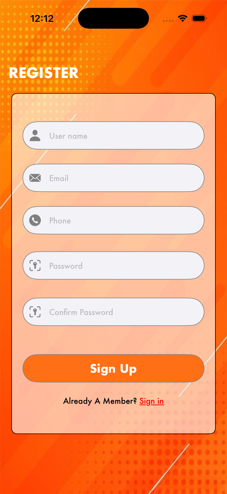
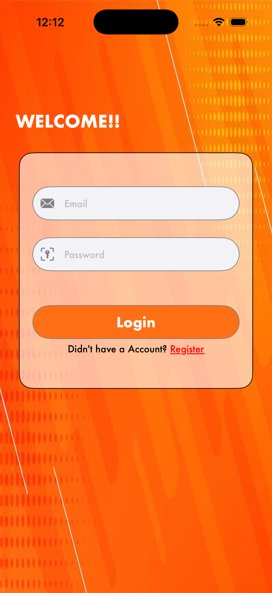

# 📱 Login & Sign-Up App (UIKit + MVVM)

A clean, scalable iOS Login & Sign-Up module built using **UIKit**, **MVVM architecture**, **AutoLayout**, and modular validation utilities. Includes reusable UI components and protocol-based networking.

## 🚀 Features

### 🔐 Authentication
- **Login** (Email + Password)
- **Register** (Username, Email, Phone, Password, Confirm Password)

### ✔️ Validations
- Empty field validation
- Email format validation
- Password strength check
- Phone number validation
- Confirm password match check

### 🧱 MVVM Architecture
- **Model** → Request & Response data structures
- **View** → `UIViewController` + Storyboard UI
- **ViewModel** → Validations + API communication
- **Service** → Networking layer

### 🧳 Reusable Components
- UI styling helpers
- Extensions (UIView, UITextField, ViewController)
- Common validation utilities
- Custom alert handlers

## 📂 Project Structure

```
Login_Swift
│
├── CommonFiles
│   ├── Constant
│   ├── CustomUIFunctions
│   │     ├── CommonUIFunctions
│   │     ├── CommonValidations
│   │     ├── Extension+UIElements
│   │     └── UIViewController+Extension
│
└── ViewControllers
    ├── LoginScreen
    │     ├── LoginModel
    │     ├── LoginService
    │     ├── LoginViewController
    │     └── LoginViewModel
    │
    └── SignUpScreen
          ├── SignUpModel
          ├── SignUpService
          ├── SignUpViewController
          └── SignUpViewModel
```

## 🖼️ Screenshots

### Sign-Up Screen


### Login Screen


## 🧠 MVVM Flow

### View (UIKit + Storyboard)
- Handles only user interactions
- Calls ViewModel for validation & API requests

### ViewModel
- Validates textfields
- Prepares request models
- Calls service methods
- Returns success/error callbacks

**Example:**

```swift
viewModel.validateFields(email: email, password: password)
```

## 📝 API Example (Service Layer)

```swift
class LoginService {

    func loginAPI(request: LoginRequest,
                  completion: @escaping (Result<LoginResponse, Error>) -> Void) {

        guard let url = URL(string: "https://yourapi.com/login") else { return }

        var urlRequest = URLRequest(url: url)
        urlRequest.httpMethod = "POST"
        urlRequest.httpBody = try? JSONEncoder().encode(request)
        urlRequest.setValue("application/json", forHTTPHeaderField: "Content-Type")

        URLSession.shared.dataTask(with: urlRequest) { data, response, error in
            if let error = error {
                completion(.failure(error))
                return
            }

            if let data = data {
                do {
                    let decoded = try JSONDecoder().decode(LoginResponse.self, from: data)
                    completion(.success(decoded))
                } catch {
                    completion(.failure(error))
                }
            }
        }.resume()
    }
}
```

## ✔️ Field Validation Examples

### Email Validation

```swift
func isValidEmail(_ email: String) -> Bool {
    let regex = "[A-Z0-9a-z._%+-]+@[A-Za-z0-9.-]+\\.[A-Za-z]{2,}"
    return NSPredicate(format: "SELF MATCHES %@", regex).evaluate(with: email)
}
```

### Password Validation

```swift
func isValidPassword(_ pwd: String) -> Bool {
    return pwd.count >= 6
}
```

### Phone Number Validation

```swift
func isValidPhone(_ phone: String) -> Bool {
    return phone.count == 10
}
```

## 📱 UI Highlights

- ✨ Rounded textfields
- 🎨 Custom icons
- 🌈 Gradient backgrounds
- 📐 AutoLayout-friendly for all iPhone sizes
- ⌨️ Smooth keyboard handling using ScrollView inset adjustment

## 🧩 Setup Instructions

1. **Clone the repository:**

```bash
git clone https://github.com/your-username/Login_Swift.git
```

2. **Open `.xcodeproj` in Xcode.**

3. **Run on Simulator or a physical device.**

4. **Update API URLs in:**
   - `LoginService.swift`
   - `SignUpService.swift`

## 🛠️ Requirements

- iOS 13.0+
- Xcode 12.0+
- Swift 5.0+

## 🔮 Future Enhancements

- [ ] JWT token authentication
- [ ] Forgot Password module
- [ ] Social login (Apple/Google)
- [ ] Unit tests for validation & services
- [ ] Dark mode UI
- [ ] Biometric authentication (Face ID / Touch ID)
- [ ] Localization support

## 🤝 Contributing

Contributions are welcome! Please feel free to submit a Pull Request.

1. Fork the project
2. Create your feature branch (`git checkout -b feature/AmazingFeature`)
3. Commit your changes (`git commit -m 'Add some AmazingFeature'`)
4. Push to the branch (`git push origin feature/AmazingFeature`)
5. Open a Pull Request

## 📄 License

This project is available under the MIT License.

## 👤 Author

**Your Name**
- GitHub: [@Prabhakaranlpn7](https://github.com/Prabhakaranlpn7)

## ⭐ Show your support

Give a ⭐️ if this project helped you!

---

Made with ❤️ using Swift & UIKit
